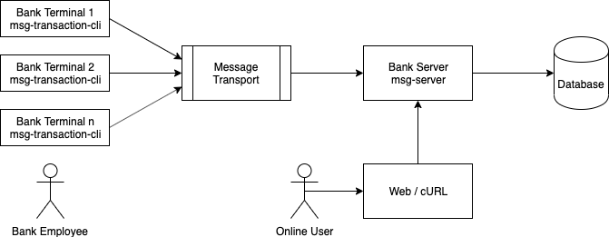

MSG Co., Ltd.
#############

You are a ``Software Developer`` at MSG Co., Ltd. and have been assigend a
project. The MSG Co., Ltd. is a startup which wants to provide a secure data
transfer for money transactions. Currently they provide analogue data
transactions, but to compete with the current market, they would like to
transform and provide a digital solution. For this reason, you have been hired
to. The MSG Co., Ltd. wahts you to implement a secure paltforn that stores user
data, account data and transaction data in a database. The following criteria
must be met:

- Keep track of the message order,
- Messages cannot be lost,
- All messages must be processed,
- Accounts cannot go below zero (0),
- Make sure to provide successful or unsuccessful transactions.

To expose an overview of the data to the management, an API is required.

Implement a tool, that can help the MSG Co., Ltd. grow in the market. You will
have to come up with a data structure for the classes required and communication
between services. For your future colleagues in is required to explain why you
chose:

- The data structure,
- The language,
- The database engine,
- The message transport layer and format,
- The design of the API,
- This way of implementation
- What you would improve in the next iteration.

Please share your solution via a public repository on GitHub or a ZIP file via
email. Make sure to also include the ``.git`` folder in your ZIP file.
